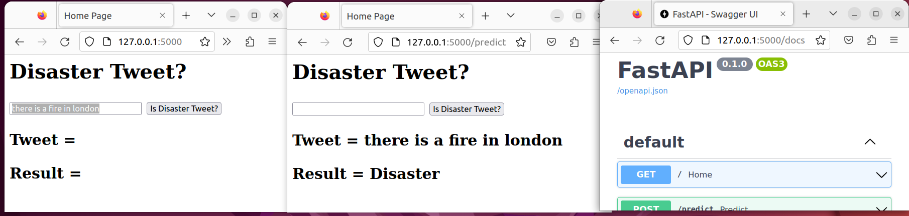

# What is it?

**Docker** files which build an image that allows a machine learning model (for tweet classification) to be accesible via HTTP requests. The image building includes training the model, which makes it easier to track which model is used but makes the image take longer to build. Currently there are Docker files for two near-identical interfaces created using **Flask** and **FastAPI** (the only real difference is the auto-generated documentation for the FastAPI implementation). The easiest way to interact with it is through a browser, though there is also a separate POST method which can be called directly through the python requests library (for example; see tests/test_post.py). See below for a picture of how this looks in practice (the second image is the result of pressing the "is Disaster Tweet?" button in the first image).

# Why make it?

The purpose of this repository is for me to practice productionizing machine learning models on a simple example system; it is not meant to actually be useful beyond that.

# Setup (Local Hosting)

Building/running the images/containers requires:

- Docker to be installed (specifically, Docker in "rootless" mode is used for the commands below)
- The training data to be downloaded from Kaggle ([here](https://www.kaggle.com/competitions/nlp-getting-started/data)) and placed in the build_models folder (build_models/train.csv needs to be present).

Images then need to be built with commands in the build_images.sh file. For example the command to build the FastAPI image is:  

**docker build -f docker/fast_api_a/Dockerfile -t dtweets_fastapi .**

Note that you need to be in the base repository directory for this to work. To create and run a container for the app will then require commands given in the run_image.sh file; for the FastAPI version using the same address as I do maps to the bash command:  

**docker run -p 127.0.0.1:5000:8000 dtweets_fastapi**

Navigating to 127.0.0.1:5000 in a browser should then allow interaction with the basic site/app.

